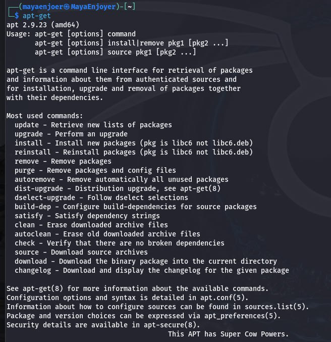
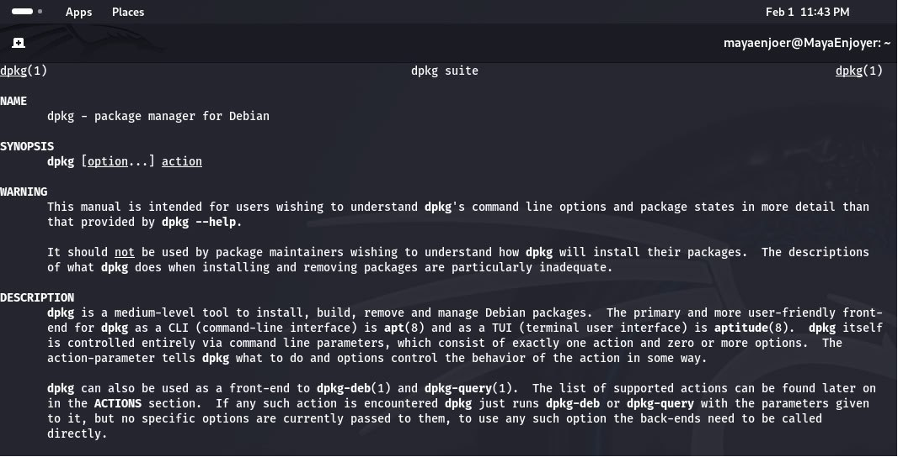
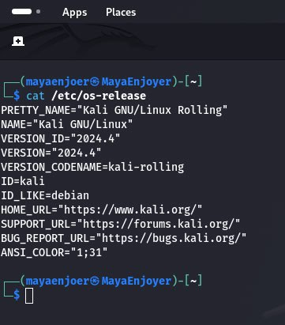
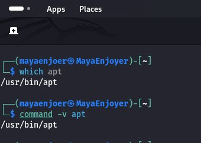
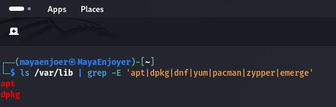

<h1 align="center">
 
  <br />
  Working with packages in Kali Linux
</h1>

#### In this work I will answer questions about how working with packages in  Kali Linux. This work is created for the purpose of educational content, as an assignment for the discipline Operating Systems of the Kyiv College of Communications.

---

```
⠀⠀⠀⠀⠀⠀⠀⠀⠀⠀⠀⠀⠀⠀⠀⠀⠀⠀⠀⠀⠀⠀⠀⠀⠀⠀⠀⠀⠀⣀⣠⣤⣤⣤⣤⣤⣤⣀⡀⠀⠀⠀⠀⠀⠀⠀⠀⠀⠀⠀⠀⠀⠀⠀⠀⠀⠀⠀⠀⠀⠀
⠀⠀⠀⠀⠀⠀⠀⠀⠀⠀⠀⠀⠀⠀⠀⠀⠀⠀⠀⠀⠀⠀⠀⠀⠀⣠⣴⣾⣿⣿⣿⣿⣿⣿⣿⣿⣿⣿⣶⣤⡀⠀⠀⠀⠀⠀⠀⠀⠀⠀⠀⠀⠀⠀⠀⠀⠀⠀⠀⠀
⠀⠀⠀⠀⠀⠀⠀⠀⠀⠀⠀⠀⠀⠀⠀⠀⠀⠀⠀⠀⠀⠀⠀⣠⣾⣿⣿⣿⣿⣿⣿⣿⣿⣿⣿⣿⣿⣿⣿⣿⣿⣦⡀⠀⠀⠀⠀⠀⠀⠀⠀⠀⠀⠀⠀⠀⠀⠀⠀⠀
⠀⠀⠀⠀⠀⠀⠀⠀⠀⠀⠀⠀⠀⠀⠀⠀⠀⠀⠀⠀⠀⠀⣼⣿⣿⣿⣿⣿⣿⣿⣿⣿⣿⣿⣿⣿⣿⣿⣿⣿⣿⣿⣿⡄⠀⠀⠀⠀⠀⠀⠀⠀⠀⠀⠀⠀⠀⠀⠀⠀
⠀⠀⠀⠀⠀⠀⠀⠀⠀⠀⠀⠀⠀⠀⠀⠀⠀⠀⠀⠀⠀⣼⣿⣿⣿⣿⣿⣿⣿⣿⣿⣿⣿⣿⣿⣿⣿⣿⣿⣿⣿⣿⣿⣿⡀⠀⠀⠀⠀⠀⠀⠀⠀⠀⠀⠀⠀⠀⠀⠀
⠀⠀⠀⠀⠀⠀⠀⠀⠀⠀⠀⠀⠀⠀⠀⠀⠀⠀⠀⠀⢠⣿⣿⣿⣿⣿⣿⣿⣿⣿⣿⣿⣿⣿⣿⣿⣿⣿⣿⣿⣿⣿⣿⣿⣇⠀⠀⠀⠀⠀⠀⠀⠀⠀⠀⠀⠀⠀⠀⠀
⠀⠀⠀⠀⠀⠀⠀⠀⠀⠀⠀⠀⠀⠀⠀⠀⠀⠀⠀⠀⢸⣿⣿⣿⣿⣿⣿⣿⣿⣿⣿⣿⣿⠿⠿⣿⣿⣿⣿⣿⣿⣿⣿⣿⣿⠀⠀⠀⠀⠀⠀⠀⠀⠀⠀⠀⠀⠀⠀⠀
⠀⠀⠀⠀⠀⠀⠀⠀⠀⠀⠀⠀⠀⠀⠀⠀⠀⠀⠀⠀⢸⡟⠁⠀⠀⠙⢿⣿⣿⣿⡿⠋⠀⠀⠀⠀⠙⣿⣿⣿⣿⣿⣿⣿⣿⡇⠀⠀⠀⠀⠀⠀⠀⠀⠀⠀⠀⠀⠀⠀
⠀⠀⠀⠀⠀⠀⠀⠀⠀⠀⠀⠀⠀⠀⠀⠀⠀⠀⠀⠀⢹⡀⠀⠀⠀⠀⠈⣿⣿⣿⠁⠀⠀⠀⠀⠀⠀⠸⣿⣿⣿⣿⣿⣿⣿⡇⠀⠀⠀⠀⠀⠀⠀⠀⠀⠀⠀⠀⠀⠀
⠀⠀⠀⠀⠀⠀⠀⠀⠀⠀⠀⠀⠀⠀⠀⠀⠀⠀⠀⠀⢨⠁⢠⣾⣶⣦⠀⢸⣿⣿⢠⣾⣿⣶⡀⠀⠀⠀⣿⣿⣿⣿⣿⣿⣿⡇⠀⠀⠀⠀⠀⠀⠀⠀⠀⠀⠀⠀⠀⠀
⠀⠀⠀⠀⠀⠀⠀⠀⠀⠀⠀⠀⠀⠀⠀⠀⠀⠀⠀⠀⢸⠀⢸⣿⣿⣿⠤⠘⠀⠘⠼⣿⣿⣿⡇⠀⠀⢀⣿⣿⣿⣿⣿⣿⣿⣿⠀⠀⠀⠀⠀⠀⠀⠀⠀⠀⠀⠀⠀⠀
⠀⠀⠀⠀⠀⠀⠀⠀⠀⠀⠀⠀⠀⠀⠀⠀⠀⠀⠀⠀⢸⣧⡀⢹⠟⠁⠀⠀⠀⠀⠀⠈⠙⢟⣁⠀⢀⣼⣿⣿⣿⣿⣿⣿⣿⣿⠀⠀⠀⠀⠀⠀⠀⠀⠀⠀⠀⠀⠀⠀
⠀⠀⠀⠀⠀⠀⠀⠀⠀⠀⠀⠀⠀⠀⠀⠀⠀⠀⠀⠀⢀⡟⠉⠁⠀⠀⠀⠀⠀⠀⠀⠀⠀⠀⠀⠉⠉⠉⠻⣿⣿⣿⣿⣿⣿⣿⡄⠀⠀⠀⠀⠀⠀⠀⠀⠀⠀⠀⠀⠀
⠀⠀⠀⠀⠀⠀⠀⠀⠀⠀⠀⠀⠀⠀⠀⠀⠀⠀⠀⠀⢸⡆⠣⡀⠀⠀⠀⠀⠀⠀⠀⠀⢀⣀⡤⠖⠀⠀⣠⣿⣿⣿⣿⣿⣿⣿⣧⠀⠀⠀⠀⠀⠀⠀⠀⠀⠀⠀⠀⠀
⠀⠀⠀⠀⠀⠀⠀⠀⠀⠀⠀⠀⠀⠀⠀⠀⠀⠀⠀⠀⣼⣿⣦⡘⠢⠤⠤⠤⠤⠤⠒⠉⠁⠀⢀⣠⣴⣿⣿⣿⣿⣿⣿⣿⣿⣿⣿⣇⠀⠀⠀⠀⠀⠀⠀⠀⠀⠀⠀⠀
⠀⠀⠀⠀⠀⠀⠀⠀⠀⠀⠀⠀⠀⠀⠀⠀⠀⠀⠀⣼⣿⣿⠟⠉⠢⣄⣢⠐⣄⠠⣄⢢⣼⠞⠉⠀⠈⠻⢿⣿⣿⣿⣿⣿⣿⣿⣿⣿⣆⠀⠀⠀⠀⠀⠀⠀⠀⠀⠀⠀
⠀⠀⠀⠀⠀⠀⠀⠀⠀⠀⠀⠀⠀⠀⠀⠀⠀⢀⣼⣿⣿⡟⠀⠀⠀⠀⠉⠙⠚⠓⠊⠉⠀⠀⠀⠀⠀⠀⠀⢻⣿⣿⣿⣿⣿⣿⣿⣿⣿⣆⠀⠀⠀⠀⠀⠀⠀⠀⠀⠀
⠀⠀⠀⠀⠀⠀⠀⠀⠀⠀⠀⠀⠀⠀⠀⠀⢠⣾⣿⣿⣿⠁⠀⠀⠀⠀⠀⠀⠀⠀⠀⠀⠀⠀⠀⠀⠀⠀⠀⠈⣿⣿⣿⣿⣿⣿⣿⣿⣿⣿⣧⠀⠀⠀⠀⠀⠀⠀⠀⠀
⠀⠀⠀⠀⠀⠀⠀⠀⠀⠀⠀⠀⠀⠀⠀⣰⣿⣿⣿⣿⣿⠀⠀⠀⠀⠀⠀⠀⠀⠀⠀⠀⠀⠀⠀⠀⠀⠀⠀⠈⢿⣿⣿⣿⣿⣿⣿⣿⣿⣿⣿⣷⡀⠀⠀⠀⠀⠀⠀⠀
⠀⠀⠀⠀⠀⠀⠀⠀⠀⠀⠀⠀⠀⠀⣴⣿⣿⣿⣿⣿⡏⠀⠀⠀⠀⠀⠀⠀⠀⠀⠀⠀⠀⠀⠀⠀⠀⠀⠀⠀⠸⣿⣿⣿⣿⣿⣿⣿⣿⣿⣿⣿⣷⡀⠀⠀⠀⠀⠀⠀
⠀⠀⠀⠀⠀⠀⠀⠀⠀⠀⠀⠀⠀⣰⣿⣿⣿⣿⣿⠟⠀⠀⠀⠀⠀⠀⠀⠀⠀⠀⠀⠀⠀⠀⠀⠀⠀⠀⠀⠀⢸⣿⣿⣿⣿⣿⣿⣿⣿⣿⣿⣿⣿⣷⠀⠀⠀⠀⠀⠀
⠀⠀⠀⠀⠀⠀⠀⠀⠀⠀⠀⠀⣰⣿⣿⣿⣿⣿⠏⠀⠀⠀⠀⠀⠀⠀⠀⠀⠀⠀⠀⠀⠀⠀⠀⠀⠀⠀⠀⠀⣾⣿⣿⣿⣿⣿⣿⣿⣿⣿⣿⣿⣿⣿⣇⠀⠀⠀⠀⠀
⠀⠀⠀⠀⠀⠀⠀⠀⠀⠀⠀⢀⣿⣿⣿⣿⣿⠃⠀⠀⠀⠀⠀⠀⠀⠀⠀⠀⠀⠀⠀⠀⠀⠀⠀⠀⠀⠀⠀⢰⣿⣿⣿⣿⣿⣿⣿⣿⣿⣿⣿⣿⣿⣿⣿⠀⠀⠀⠀⠀
⠀⠀⠀⠀⠀⠀⠀⠀⠀⠀⠀⣼⣿⣿⣿⣿⡇⠀⠀⠀⠀⠀⠀⠀⠀⠀⠀⠀⠀⠀⠀⠀⠀⠀⠀⠀⠀⠀⢠⣿⣿⣿⣿⣿⣿⣿⣿⣿⣿⣿⣿⣿⣿⣿⣿⡇⠀⠀⠀⠀
⠀⠀⠀⠀⠀⠀⠀⠀⠀⠀⢰⣿⣿⣿⣿⣿⠀⠀⠀⠀⠀⠀⠀⠀⠀⠀⠀⠀⠀⠀⠀⠀⠀⠀⠀⠀⠀⢠⣿⣿⣿⣿⣿⣿⣿⣿⣿⣿⣿⣿⣿⣿⣿⣿⣿⡇⠀⠀⠀⠀
⠀⠀⠀⠀⠀⠀⠀⠀⠀⠀⣾⣿⣿⣿⣿⣿⠂⠀⠀⠀⠀⠀⠀⠀⠀⠀⠀⠀⠀⠀⠀⠀⠀⠀⠀⠀⢀⣿⣿⣿⣿⣿⣿⣿⣿⣿⣿⣿⣿⣿⣿⣿⣿⣿⣿⠇⠀⠀⠀⠀
⠀⠀⠀⠀⠀⠀⠀⠀⠀⢰⣿⣿⣿⣿⣿⣿⠃⠀⠀⠀⠀⠀⠀⠀⠀⠀⠀⠀⠀⠀⠀⠀⠀⠀⠀⠀⣼⣿⣿⣿⣿⣿⣿⣿⣿⣿⣿⣿⣿⣿⣿⣿⣿⣿⣿⡀⠀⠀⠀⠀
⠀⠀⠀⢀⠀⠀⠀⠀⠀⢸⣿⣿⣿⣿⣿⣿⡆⠀⠀⠀⠀⠀⠀⠀⠀⠀⠀⠀⠀⠀⠀⠀⠀⠀⠀⢸⣿⣿⣿⣿⣿⣿⣿⣿⣿⣿⣿⣿⣿⣿⣿⣿⣿⣿⣿⡇⠀⠀⠀⠀
⠀⠀⠀⠀⠀⠀⠀⠀⠀⢸⣿⣿⣿⣿⣿⣿⣧⠀⠀⠀⠀⠀⠀⠀⠀⠀⠀⠀⠀⠀⠀⠀⠀⠀⠀⣿⣿⣿⣿⣿⣿⣿⣿⣿⣿⣿⣿⣿⣿⣿⣿⣿⣿⣿⣿⣷⠀⠀⠀⠀
⠀⠀⠀⡰⠉⠈⠑⠠⢀⢸⣿⣿⣿⣿⣿⣿⣿⡆⠀⠀⠀⠀⠀⠀⠀⠀⠀⠀⠀⠀⠀⠀⠀⠀⠰⣿⣿⣿⣿⣿⣿⣿⣿⣿⣿⣿⣿⣿⣿⣿⣿⣿⣿⣿⣿⣿⡄⠀⠀⠀
⠀⠀⠀⡇⠀⠀⠀⠀⠀⠉⠙⠛⠛⠛⠿⠿⣿⣿⡀⠀⠀⠀⠀⠀⠀⠀⠀⠀⠀⠀⠀⠀⠀⠀⠈⣿⣿⣿⣿⣿⣿⣿⣿⣿⣿⣿⡿⠟⠉⠀⠀⠀⠘⢿⣿⣿⡇⠀⠀⠀
⠀⠀⠀⡇⠀⠀⠀⠀⠀⠀⠀⠀⠀⠀⠀⠀⠀⠙⣧⠀⠀⠀⠀⠀⠀⠀⠀⠀⠀⠀⠀⠀⠀⠀⠀⢻⣿⣿⣿⣿⣿⣿⣿⣿⠟⠉⠀⠀⠀⠀⠀⠀⠀⠘⣿⣿⡇⠀⠀⠀
⠀⠀⢰⠃⠀⠀⢠⠀⠀⠀⠀⠀⠀⠀⠀⠀⠀⠀⠘⡇⠀⠀⠀⠀⠀⠀⠀⠀⠀⠀⠀⠀⠀⠀⠀⣾⠘⣿⣿⣿⣿⣿⡟⠁⠂⠀⠀⠀⠀⠀⠀⠀⠀⠀⢻⣿⡇⠀⠀⠀
⠀⡠⠊⠀⢀⠐⡀⠈⠄⠂⡐⠀⢂⠐⠈⠠⢀⠀⠀⢻⡤⠀⠀⠀⠀⠀⠀⠀⠀⠀⠀⠀⠀⠀⠀⣷⠀⢀⠛⡛⢫⠑⡄⢃⡐⢈⠐⡀⠄⠐⠀⠀⠀⠀⠈⢿⡇⠂⠀⠀
⢠⢁⠀⠄⢂⡐⠠⡁⠌⡐⠠⢁⠂⠌⢠⢁⠂⡐⠀⠘⣿⣳⢤⡀⡀⢀⠀⡀⢀⠀⡀⠠⡀⠤⣁⢿⠀⠄⣂⠑⡂⠥⡘⢠⠐⢂⠰⠀⠌⡐⢈⠐⡀⠀⠀⠀⠑⢄⠀⠀
⠈⢧⡘⡐⢂⠤⠑⡠⢁⠆⡁⠆⠌⣂⠁⡂⠌⡐⠀⠀⢹⣿⣷⣧⣝⣢⠱⡰⣈⢆⢡⢃⠴⡱⣌⣾⠈⡐⢠⠘⡠⢁⠆⡡⢘⠠⡁⠎⡐⡈⢄⠢⢀⠡⢀⠈⠂⠀⠑⡀
⠀⠀⠙⢵⣊⠴⡁⢆⠡⢂⠅⡊⠔⡠⠘⢄⠒⡀⢁⠀⠀⢻⣿⣿⣿⣿⣿⣷⣷⣾⣶⣿⣾⣿⣿⣿⠀⠐⡄⠢⢁⠆⡘⢄⠡⢂⠱⢠⠑⡨⢄⠢⣁⠒⡄⢊⠄⣂⢀⡡
⠀⠀⠀⠀⠉⠲⣍⢢⠱⡈⢆⠱⡈⠔⡉⢄⠒⠄⢂⠀⢀⠀⢿⣿⣿⣿⣿⣿⣿⣿⣿⣿⣿⣿⣿⡟⠀⠂⢄⠣⠌⣂⠱⡈⢆⠡⢊⠄⢣⠐⢢⠑⡄⢣⡘⢆⡳⣬⠞⠁
⠀⠀⠀⢀⠀⠀⠈⢣⡞⡰⢈⠆⡱⢈⠔⡨⢘⡈⠆⢌⠀⡐⠨⣿⣿⣿⣿⣿⣿⣿⣿⣿⣿⣿⣿⡇⠠⢉⠄⢢⠑⡄⢣⠘⡄⠣⢌⢊⡔⡉⢦⠩⡜⣡⢞⡷⠋⠁⠀⠀
⠀⠀⠀⠀⠀⠀⠀⠀⠙⢶⡉⢆⡱⢈⠆⡑⠢⢌⡘⢄⠣⡐⣡⠏⠉⠉⠉⠉⠉⠉⠉⠉⠍⠉⠉⢳⢁⠊⡜⢠⠃⡜⢠⠃⣌⠱⣈⠦⢰⡉⢆⡳⣼⠟⠁⠀⠀⡆⠀⠀
⠀⠀⠀⠀⠀⠀⠀⠄⠀⠀⠹⣖⡰⢃⡜⢄⠳⣠⠚⣌⠖⣥⡿⠀⠀⠀⠀⠀⠀⠀⠀⠀⠀⠀⠀⠘⣎⠴⡈⢆⠱⡈⢆⠱⡠⢃⠖⣌⠣⣜⢣⠟⠁⠀⠀⠀⠀⠃⠀⠀
⠀⠀⠀⠀⠀⠀⠀⠀⠀⠀⠀⠈⠓⢯⡼⣬⣓⣦⣟⣼⡿⠚⠁⠀⠀⠀⠀⠀⠀⠀⠀⠀⠀⠀⠀⠀⠙⣶⣉⢆⠳⡌⡜⢢⠱⡩⢜⣤⢻⡼⠋⠀⠀⢸⠀⠀⠀⠀⠀⠀
⠀⠀⠀⠀⠀⠀⠀⠀⠀⠀⠐⠀⠀⠀⠉⠙⠛⠛⠋⠉⠀⡀⠀⠀⠐⠀⠀⠀⠀⠀⠀⠀⠀⠀⠀⠀⠀⠈⠛⢾⣳⣼⣜⣧⣳⡽⣞⠞⠋⠀⠀⠀⠀⠒⠀⠀⠀⠀⠀⠀
⠀⠀⠀⠀⠀⠀⠀⠀⠀⠀⠀⠀⠀⠀⠀⠀⠀⠀⠀⠀⠀⡇⠀⠀⠀⠀⠀⠀⠀⠀⠀⠀⠀⠀⠀⠈⠀⠀⠀⠀⠈⠉⣉⢉⣉⠉⠀⠀⠀⠀⠀⠀⠀⠀⠀⠀⠀⠀⠀⠀
```
---

#### In Linux, effective software management is carried out using package managers, which work with packages and repositories, so before we start working with packages in Kali Linux, let's look at concepts such as packages and repositories.

## What are packages on Linux?
- Package in Linux:
  Most software applications designed for Linux or Unix systems are distributed as packages, which are archives that contain the pre-compiled binary software files, installation scripts, configuration files, dependency requirements, and other details about the software. These packages are typically specific to a particular distribution and formatted in that distribution’s preferred package format, such as `.deb` for Debian/Ubuntu/Kali Linux and `.rpm` for CentOS/RHEL.

- While it’s relatively simple for a user to install a package file, there are other complexities to consider. These complexities include obtaining (downloading) the package, ensuring packages are upgraded with security and bug fixes, and maintaining all the dependencies for the software.

## What are repositories on Linux?
- Repositories are simply places where packages are stored, usually accessible over the Internet. A repository can contain one or thousands of packages. Most Linux distributions have their own unique repositories, sometimes with core packages divided into one and additional features into others.
  Each distribution has its own official repositories. 
#### These can be divided into different categories:

* Core — contains the basic packages for the system to work.

* Additional — contains additional tools and utilities.

* Experimental — includes the latest, still unstable versions of programs.

A user can obtain package files via any file transfer method, but usually repositories are used to obtain packages, so most users download most programs from repositories, because it is much faster, more convenient, and safer.

---

## Package managers in Linux:
First, let's look at what a Package Manager is.
A package manager is a set of software in Linux that performs configuration, installation, removal, etc. The package manager also updates both individual packages/programs and the entire system.
#### Some of the most famous package managers are:
- Yum and RPM - in Red Hat-like systems;
- Apt — on Debian, Ubuntu, and similar systems
- Dpkg - in Debian-like systems;
- Pacman - in Arch Linux;
- Portage and Paludis - in Gentoo;
- Zypper — on openSUSE
- Snap — on all Linux distributions
- Flatpak — on all Linux distributions
- Npm — for JavaScript
- Pip — for Python
- AppImage — on all Linux distributions
- Conda — for Python and science
- Chocolatey — for Windows (but can be used on Linux via WSL)
- Nix — on Linux
- Homebrew — for Linux (ported from macOS)

### RPM Package Manager:
RPM is the RPM package manager for Red Hat-like systems. This package allows you to install, uninstall, and update software. The main advantages of this manager include the following:
- Simplicity of the process of updating, uninstalling packages;
- Ability to verify GPG signature and checksum to verify the integrity of the package;

#### Basic RPM commands:
| **Commands**                              | **Description**                                                                                      |                                                                                                 
|-------------------------------------------|------------------------------------------------------------------------------------------------------|
| **`rpm --import RPM-GPG-KEY`**            | The command imports the GPG key, which is needed to verify packages.                                 | 
| **`rpm -qip packagename.rpm`**            | The command helps to view information about the packagename.rpm packages located in the directories. | 
| **`rpm -qlp packagename.rpm`**            | The command helps to view the lists of files in an uninstalled package.                              |
| **`rpm -qp --scripts packagename.rpm`**   | The command looks at %pre-%post-install (uninstall) scripts.                                         | 
| **`rpm -qp --changelog packagename.rpm`** | The team helps review the package changelog.                                                         | 
| **`rpm -qR packagename`**                 | Allows you to view dependencies for the specified package.                                           | 
| **`rpm -ivh packagename.rpm`**            | The command allows you to install packages.                                                          | 
| **`rpm -qi packagename`**                 | The command views information about a package that is already installed on the system.               |
| **`rpm -Uvh packagename.rpm`**            | The command provides an update or installation of a package.                                         | 
| **`rpm -Fvh packagename.rpm`**            | The command updates packages if a previous version is already installed on the system.               | 
| **`rpm -e packagename`**                  | The command removes a package.                                                                       | 
| **`rpm -qa --last`**                      | The command allows you to view the installation dates of packages.                                   | 
| **`rpm -qa`**                             | Allows you to view a list of all packages installed on the system.                                   | 
| **`rpm -qa “client*”`**                   | The command searches for all packages starting with client.                                          |
| **`rpm -qf /etc/rc.conf`**                | The command recognizes the belonging of the rc.conf file to any package.                             |


### Apt package manager:
APT is a Debian utility that installs, updates packages, and tracks their dependencies. The goal of the program was to automate the process of package management, including updating and maintaining dependencies, which, when working directly with the **dpkg** manager, was done manually. We can manipulate packages using the **apt-get** program.

The general structure of the apt-get command is `apt-get [options] command package1 package2 … packageN`.



To install this package, we need to use the following command: `apt-get install packagename`.

### Yum package manager:
Yum is an open source package manager for Red Hat-like systems. It was created to facilitate the process of updating the system, taking into account the interrelationships of packages. Also, Yum searches for RPM packages in repositories, installs them, tracks dependencies between packages, removes unused packages, and downgrades.
By default, the manager is managed through the console, but it is possible to install additional components for work through a graphical interface (PackageKit).

The general command template for working with Yum looks like this: `yum [parameter] [command] [package name]`.
To install `yum` for VPS hosting of any package, the following command is used: `yum install packagename`.
However, if we need to install several packages, then for this we need to specify them with a space, for this we will use the following command: `yum install package1 package2 …`.

### Dpkg package manager:
DPKG is a package manager for Debian-like systems. It allows you to get information about .deb packages, and also allows you to install or remove them.
To call the developer's documentation we can use the following command: `man dpkg`.



To install the package on the system, we need to enter the following command in the terminal: `dpkg -i packagename.deb`.

### Pacman package manager:
Pacman is the default package manager for Arch Linux and its derivatives. It was designed to be simple, lightweight, and powerful. Pacman manages dependencies, installs, updates, and removes packages from the system. It uses a binary package format and works with repositories to simplify the installation process. The general structure of the Pacman command is as follows: `pacman [options] [command]`.

The general structure of the Pacman command is as follows:`pacman [options] [command] [package1] [package2] ... [packageN]`.

To install a package using Pacman, we can use the following command: `sudo pacman -S packagename`.

To upgrade the system, we need to use the following command: `sudo pacman -Syu`.


### Portage and Paludis package manager:
Portage is the main package management system for Gentoo. It is a source-based package manager that compiles software specifically for the user's system, allowing for extensive customization. Paludis is an alternative to Portage that offers us additional features. Both systems rely on ebuild.

The general structure of the Pacman command is as follows:`emerge [options] [package]`.

To install a Portage package, we can use the following command: `sudo emerge packagename`.

To upgrade the system, we need to use the following command:
`sudo emerge --sync && emerge -uDNav world`.

### Zypper package manager:
Zypper is a command line package manager for openSUSE. It provides us with tools to install, update, and manage software packages. Zypper also supports RPM packages, and online repositories. Its syntax is simple and efficient, making it suitable for both interactive and automated tasks.

The general structure of the Pacman command is as follows:`zypper [options] [command] [package1] [package2] ... [packageN]`.

To install the Zypper package we need to use this command: `sudo apt install zypper`.

To update the system we need to use this command: `sudo zypper update`.

### Snap package manager:
Snap is a universal package manager that is available in all major Linux distributions. It allows us to distribute applications in a containerized format, ensuring compatibility between different systems.

The general structure of the Snap command is as follows:`snap [options] [command] [package]`.

To install our Snap package, we need to use the following command: `sudo apt install snapd`.

To update the packages, we need to use the following command:`sudo snap refresh`.

### Flatpak package manager:
Flatpak is another universal package manager similar to Snap, but with a focus on desktop applications. Like Snap, it allows software to run on any Linux distribution with all dependencies included in the package. It is known for its improved security.

The general structure of the Flatpak command is as follows:`flatpak [options] [command] [package]`.

To install our Flatpak package, we need to use the following command: `sydo flatpak install flathub packagename`.

To update the packages, we need to use the following command:`sudo flatpak update`.


### Npm package manager:
Npm is a package manager for Node.js, we can mainly use it to manage JavaScript libraries and packages. It is quite widely used for web development and JavaScript-based applications. The `npm` registry contains a huge collection of libraries.

The general structure of the Npm command is as follows:`npm [options] [command] [package]`.

To install our Npm package, we need to use the following command: `sudo npm install packagename`.

To update the packages, we need to use the following command:`sudo npm update packagename`.

### Pip package manager:
Pip is a package manager for Python that allows us to install and manage Python packages from the Python Package Index (PyPI). It is a fairly standard dependency management tool for Python projects.

The general structure of the Pip command is as follows:`piр [options] install [package]`.

To install our Pip package, we need to use the following command: `piр install packagename`.

To update the packages, we need to use the following command:`piр install --upgrade packagename`.

### AppImage package manager:
AppImage is a universal format used for distributing software on Linux. Each AppImage package contains the application and all the necessary libraries. It does not require installation, it can simply be made executable to run directly, using:
```
chmod +x appname.AppImage
./appname.AppImage
```

### Conda package manager:
Conda is a cross-platform package manager used to manage environments and dependencies for data processing, Python, and R. It is popular in scientific computing and provides a solution for managing packages in computing environments.

The general structure of the Conda command is as follows:`сonda [options] install [package]`.

To install our Conda package, we need to use the following command: `сonda install packagename`.

To update the packages, we need to use the following command:`сonda update --all`.

### Chocolatey package manager:
Chocolatey is a package manager that was primarily designed for Windows, but can also be used on Linux via the Windows Subsystem for Linux (WSL). Chocolatey packages automate the installation of software.

The general structure of the Chocolatey command is as follows:`choco [options] [command] [package]`.

To install our Chocolatey package, we need to use the following command: `choco install packagename`.

To update the packages, we need to use the following command:`choco upgrade all`.

### Nix package manager:
Nix is a package manager for Linux that emphasizes reproducibility and declarative package management, providing an isolated environment for installing each package.

The general structure of the Nix command is as follows:`nix-env [options] [command] [package]`.

To install our Nix package, we need to use the following command: `nix-env -iA nixpkgs.packagename`.

To update the packages, we need to use the following command:`nix-env -u`.

### Homebrew package manager:
Homebrew is a very popular package manager for macOS that has been ported to Linux. It focuses on simplicity and ease of use, providing a simple way to install and manage packages on Linux.

The general structure of the Homebrew command is as follows:`brew [options] [command] [package]`.

To install our Homebrew package, we need to use the following command: `brew install packagename`.

To update the packages, we need to use the following command:
```
brew update
brew upgrade
```
---

## Now let's take a look at the package manager used in our Kali Linux:
#### In order to find out which package manager our Kali Linux uses, we can use the following methods:

1) We can check the `os-release` file, it contains information about our distribution, for this we will use the following command: `cat /etc/os-release`.

After using the command, the terminal will show the name and version of the OS, by which we can further determine the package managers.



Based on what the `cat /etc/os-release` command outputs, we can conclude that our Kali Linux Rolling is based on Debian (`ID_LIKE=debian`).

Therefore, this means that we use the following package managers:
- apt – is the main package manager for installing and updating programs.
- dpkg – is a low-level tool for working with .deb packages.

We can check these packages using the following commands:
```
apt --version
dpkg --version
```

2) We can also use the `which` or `command -v` commands to determine the package manager:

```
which apt (checks all known installed package managers)
command -v apt (shows which package manager is available on the system)
```


3) And finally, in my opinion, the best way to find out about the package manager you are using is to use `/var/lib`:

Most package managers store their database in `/var/lib`, so if we use this command, it will show which package managers we are using:`ls /var/lib | grep -E 'apt|dpkg|dnf|yum|pacman|zypper|emerge'`.



---

## Now let's look at the basic commands for working with Kali Linux:
### I divide the main commands for working with Kali Linux into the following 7 points: 

#### 1) I decided to dedicate the first point to commands for searching and package information.

- To find a package by keyword we can use this command: `apt-cache search keyword`.

- To view information about a package we need to use this command: `apt-cache show package-name`.

- To check which package a file belongs to, we can use this command: `dpkg -S /path/to/file`.

- We can also view the dependencies of a package using the command: `apt-cache depends package-name`.

- To find packages that depend on a specific package we need to use this command: `apt-cache rdepends package-name`.

#### 2) In the second point, I will talk about installing the package.
- To install multiple packages with one command, we use the following command: `sudo apt install package1 package2 package3`.
- To reinstall packages (for example, if a package was corrupted), we can use the following command: `sudo apt install --reinstall package-name`.
- To install all updates without confirmation, we need to use the following command: `sudo apt upgrade -y`.
- To install a package ignoring dependencies, we need to use this command: `sudo dpkg -i --force-all package-name.deb`.
##### But I want to warn you that these commands should be used very carefully, because they can break the system❗❗❗

#### 3) In the third point, I will talk about the commands for removing and cleaning packages.
- In order to remove a package along with all its configuration files, we need to use the following command: `sudo apt purge package-name`.
- To remove unnecessary libraries that are no longer needed, we need to use the following command: `sudo apt autoremove`.
- To clean the cache of downloaded .deb files, we need to use the following command: `sudo apt clean`.
- In order to remove old .deb files, but leave the latest ones, we need to use the following command: `sudo apt autoclean`.

#### 4) In the fourth point, I would like to talk about the commands used to update the system.
- To update the list of available packages, we need to use the following command: `sudo apt update`.
- In order for us to update all installed packages, we need to use the following command: `sudo apt upgrade`.
- In order to update all packages, including changing dependencies, we need to use the following command: `sudo apt full-upgrade`.
- To update the distribution to a new version, we need to use the following command: `sudo apt dist-upgrade`, but keep in mind that this command will only work if the distribution supports upgrades.
- In order to check which packages need to be updated, we need to use the following command: `apt list --upgradable`.

#### 5) In the fifth point I will tell you what commands are needed to work with repositories.
- In order to add a new repository, we need to use the following command: `echo "deb http://your-repo-url kali-rolling main" | sudo tee -a /etc/apt/sources.list`. After that, do not forget to update the package list (`sudo apt update`).
- To check the list of active repositories, we need to use the following command: `cat /etc/apt/sources.list`.
- In order to fix problems with repository signatures, we need to use the following command: `sudo apt install --reinstall kali-archive-keyring -y`, if the problem persists, then we need to use the following commands:
```
sudo rm -rf /etc/apt/trusted.gpg.d/kali-archive-keyring.gpg
sudo apt update && sudo apt install --reinstall kali-archive-keyring -y
```
- In order to update the repository keys (to fix errors with GPG, we need to use the following command: `sudo apt-key update`.

#### 6) In the sixth point I will tell you how to manage packages without APT.
- In order to install a .deb package manually, we need to use the following command: `sudo dpkg -i package-name.deb`.
- To fix dependency errors after installing a .deb, we need to use this command: `sudo apt --fix-broken install`.
- If we need to check which files belong to the installed package, then we need to use this command: `dpkg -L package-name`.
- In order to find out the version of the installed package, we need to use this command: `dpkg -s package-name | grep Version`.

#### 7) In the seventh point, I will show you additional commands that will help you use Kali Linux more comfortably.
- In order to enable Bluetooth on Kali Linux, we need to use the following command: `service bluetooth start`. Of course, you can say that this can be done in the settings menu, without using commands, but I will answer you that Kali Linux unfortunately will not enable Bluetooth without using this command, Kali Linux will simply automatically disable Bluetooth without using commands.
- For this, if we need to view a certain number of recently installed packages, then for this we can use the following command: `grep "install " /var/log/dpkg.log | tail -Number of packages we need to review`.
- If we need to place all installed packages by their size, then we can use the following command: `dpkg-query -Wf '${Installed-Size}\t${Package}\n' | sort -n`.
- If we need to find and remove broken packages, we can use the following command: `sudo dpkg --configure -a`.
- To check the speed of downloading packages from the repositories, we can use the following command: `apt update 2>&1 | grep "Hit" | awk '{print $NF}'`.

---

## Installing the development environment and video-audio player:
Before installing any software, we need to update the list of all available packages, this can be done using the command:`sudo apt update && sudo apt upgrade -y`.
After we have updated all the packages, we can proceed to install the video or audio player. I suggest using one of these two video and audio players:
- VLC is one of the most popular multimedia players for Linux.
- MPV is an easy-to-use media player.

In order to install VLC, we need to enter this command in the terminal:`sudo apt install vlc -y`. After that, we only have to run VLC using the `vlc` command.

And in order to install MPV, we need to enter this command: `sudo apt install mpv -y`. In order to run our media player, we must use this command `mpv`.

#### I spend most of my time working with Python in the PyCharm, so I'll show you how to install Python and PyCharm via the console:

Usually, the standard Kali Linux repositories already have Python versions, usually this version supports all modules and so on, so it may not be the newest version. Therefore, if we want to install a newer version of Python, or somehow our Kali Linux does not have Python installed, then it is better to install the required Python version manually.
But before starting, I recommend checking the availability of Python, this can be done using the following command: `python3 --version`.
If the command did not find the Python version, then the first thing we need to do is add the Python repository, this can be done using these commands:
```
sudo add-apt-repository ppa:deadsnakes/ppa
sudo apt update
```
PS: I will show the example of Python version 12.0, because in my opinion this is the best, optimized version that supports working with all the necessary modules.

After we have created the repositories, we need to install Python 12.0, this can be done using the command: `sudo apt install python3.12 -y`.

After installing the version, we need to check if our version is installed correctly, to check this we can use the command: `python3.12 --version`.

Next, we just need to update pip - the Python package manager, this can be done using these commands:
```
python3.12 -m ensurepip --default-pip
python3.12 -m pip install --upgrade pip
```
After successfully installing the Python version, we can proceed to install PyCharm. PyCharm can be installed in two ways:
#### 1) PyCharm can be installed via Snap. To do this, we need to use the following commands:
```
sudo apt install snapd -y
sudo snap install pycharm-community --classic
```

#### 2) Manual installation from the official website archive. To do this, the first thing we need to do is download the archive from the official website, this can be done using the command:`wget https://download.jetbrains.com/python/pycharm-community-2023.3.tar.gz`, after which we need to unpack this archive, this can be done using this command:`tar -xvzf pycharm-community-2023.3.tar.gz`.
Next, all we have to do is launch PyCharm, which can be done using the following commands:
```
cd pycharm-community-*/bin
./pycharm.sh
```
Next, we only have to check the installed programs, for this we can use the following commands:
```
vlc --version
mpv --version
audacious --version
python3.12 --version
pycharm-community --version
```
If everything is fine, all the programs are perfectly installed and working, all we have to do is perform the final system update, this can be done using the command:`sudo apt update && sudo apt upgrade -y`.

And then all we have to do is work in PyCharm with configuration, etc.

---

### Now let's look at how to install programs in Kali Linux through app stores and package managers in a graphical environment.
##### In Kali Linux, you can install programs both through the terminal and through the graphical interface. So let's look at some ways:

#### 1) The first method I suggest using is installing programs through the "GNOME Software" application store.

Kali Linux uses GNOME or Xfce by default. And GNOME has a built-in GNOME Software application store, which allows us to install programs in graphical mode.

To open GNOME Software, we need to enter the following command in the terminal: `gnome-software`.

In order to install a program through GNOME Software, we need to go to the "Explore" tab, and using the search field, find the desired program. After we have found the program we need, we must click on it and select "Install". After we click "Install", Kali Linux will ask for the administrator password. Then we only have to click on "Launch", after which our program will start.

#### 2) The second method that I suggest using is installing programs through Synaptic Package Manager.

Synaptic is a powerful graphical tool for managing APT packages.
In order to install Synaptic, we will use the following command: `sudo apt install synaptic -y`. After that, we need to open Synaptic, this can be done using the command: `synaptic`.
After we have entered Synaptic, we need to enter the name of the program we want to install in the search field. Then we need to click "Mark for Installation".
Next, we just need to click "Apply" and wait for the process to complete, after the download is complete, the program will be installed and available in the "Applications" menu.

But in my opinion, all these application stores are unnecessary things, because we have a terminal through which we can implement the download much faster than through utilities.

#### I WILL END HERE. I WISH EVERYONE A GOOD MOOD AND MORE JOYFUL MOMENTS!!!


